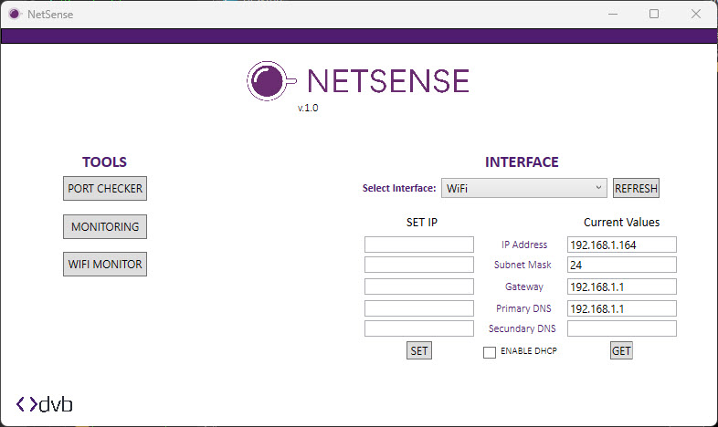
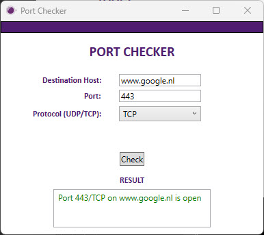
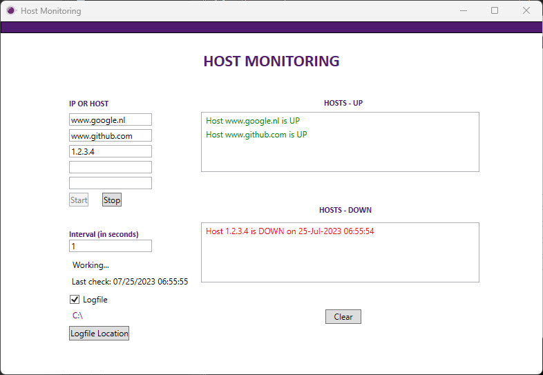
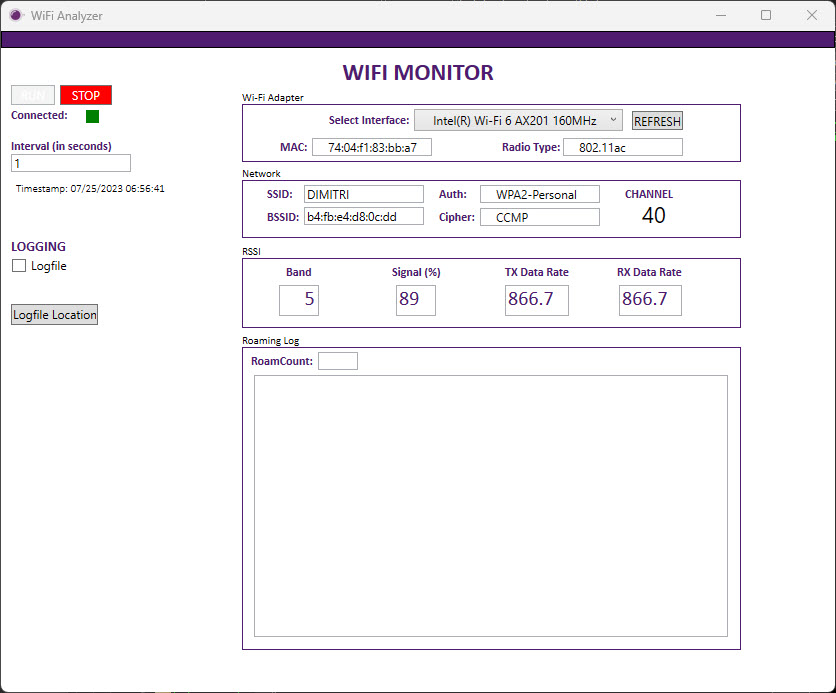

# NetSense

NetSense is an open-source network tool made by DVB that provides a suite of features:

- Port Checker (TCP & UDP)
- Monitoring Tool with logging (Check the status of IP-addresses or hostnames with custom interval)
- WiFi Analysis with Roaming Logging (Monitor WiFi signal strength and roaming between access points)
- Interface IP Settings Management (Configure static/DHCP, DNS, etc. fast instead of the Windows menu's to change IP settings)

## Installation

To use NetSense, follow these steps:

1. Clone the repository: `git clone https://github.com/dvbnl/NetSense.git`
2. Navigate to the project directory: `cd NetSense` and verify the checksum
3. Run the executable

## Usage

1. After running the executable, the user interface will be displayed.
2. Select the desired feature from the available options.
3. Enjoy using the NetSense tool

## Checksums

To ensure the integrity of the executable, you can verify it with the following checksums:

- **MD5**: 343F20DE46C626856C72E2359B17C3CF
- **SHA1**: F83D0830093CFBF4FEDF019D35B169194B1151CE
- **SHA256**:4DB5DE56B87DE9D75FCE2A4D77545F9436703065B13C65314DD06BE2AFFF2D6D

The executable is built using the files in the 'src' directory.

## Screenshots

Main app:

Portchecker:

Hostmonitor:

Wifimonitor:

## Contributing

Contributions are welcome! If you would like to contribute to NetSense, please follow these steps:

1. Fork the repository: [https://github.com/dvbnl/NetSense/fork](https://github.com/dvbnl/NetSense/fork)
2. Create a new branch for your changes: `git checkout -b feature/your-feature-name`
3. Make your changes and commit them with descriptive messages: `git commit -m "Add your message here"`
4. Push your changes to your forked repository: `git push origin feature/your-feature-name`
5. Open a pull request against the `main` branch of this repository.

## Credits

- Netsh-wlanmon by mackenziewifi

## License

NetSense is licensed under the [MIT License](https://github.com/dvbnl/NetSense/blob/main/LICENSE). Feel free to use, modify, and distribute this tool as you see fit.
